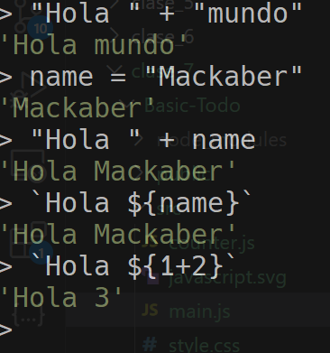

- Manejo de CSS clases con JavaScript
- Manejo de proyects con Vite:
    - Setup
    - Componentes

# Vite
Es una herramienta para el front, como una tipo librería

se descarga con la terminal de visual studio code y se escribe "npm install vite -g" el -g lo que hace es que se instale en general en la compu (los pasos están resumidos en la parte de comandos que se encuentra abajo)

Si aparece error, hay que abrir una terminal(powershell) en la computadora y ejecutarlo como administrador, después escribimos "Set-ExecutionPolicy Unrestricted"

Una vez cargado escribimos "Yes"

Para verificar que si se instaló escribimos en la terminal de visual studio code "npm --version"

También se puede hacer lo de la clase en codespaces de github

------------
PARA INICIALIZAR VITE
Ponemos en la terminal de visual studio code ya en el directorio donde queremos "npm create vite@latest"
Basicamente lo que nos dice es que vamos a crear un vite en donde estamos

Ya que cargó le ponemos el nombre para el archico y el framework, escogemos el mas secillo que es vanilla y javascript.

Nos crea una estructura para realizar proyectos más complejos.

Para correr hay que apagar Go Live y seguir las instrucciones que nos generó en la terminal de visual, que es lo que mencionamos abajo en comandos 

## Setup
    
Comandos:

1. $ npm install vite -g

2. $ npx create-vite@latest
    - Seleccionar vanilla
    - Seleccionar javascript

3. $ cd my-project

4. $ npm install

5. $ npm run dev

### String templates

